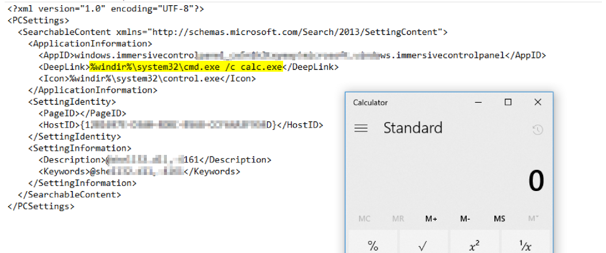

## CVE Search

CVE (Common Vulnerabilities and Exposures) is a standard for identifying publicly disclosed information security vulnerabilities and exposures. Attackers frequently use it as a starting point for planning an attack. For example, in the RiskSense report, which examines 22 years of CVE data on nearly 3,000 vulnerabilities against Adobe products, weaponized vulnerabilities against the Adobe family of products rose 139% between 2017 and 2018. Another example, in July of 2018, Bleeping Computer reported the weaponization of a shortcut vulnerability in Microsoft Windows SetttingContent-ms files to execute code (in this case a RAT, or remote access Trojan) on a Windows 10 OS.

**Searching for known finding by its CVE ID of CVE-2018-8414 belong to 'Microsoft Windows SetttingContent-ms**

**Search result of CVE-2018-8414 belong to 'Microsoft Windows SetttingContent-ms**

**Weaponization of 'Microsoft Windows SetttingContent-ms' extension allow to execute any commands**  

Similarly, Citrix ADC and Gateway allowed directory traversal vulnerability (CVE-2019-19781) that leads attacker to gain remote code execution on the server. Citrix appliance does not sanitize and writes to an XML file that is created on the local file system. While writing to an XML file does not directly have to lead to remote code execution injecting Perl Template Toolkit instructions and parsing the file as a template does lead to code execution.

**Search result for known finding by its name 'Citrix ADC and Gateway Directory Traversal**

**Weaponization of 'Citrix ADC and Gateway Directory Traversal' allowing to execute any commands on the server**

**Execution OS commands as a result of weaponizing the publicly disclosed vulnerability**  

Official CVE Publications can be accessed via the following sources:

- NIST (<https://nvd.nist.gov/vuln/search>)

- CVE Mitre (<https://cve.mitre.org/>)

- CVE (<https://www.cve.org/>)

Other pages can be useful for searching CVEs

- CVEDetails (<https://www.cvedetails.com/>)

- CIRCL CVE Search (<https://cve.circl.lu/>)

- snyk Vulnerability DB Open Source (<https://security.snyk.io/>)

What infra/dev people should do?

This gap between availability of exploit versus availability of patch for the vulnerability being exploited creates a window of opportunity that organizations should be concerned with.  

- Software/patch management

- Inventory Your Systems: Any patch management procedure must start with a thorough inventory of all software and hardware in your environment. The inventory should include all servers, workstations, storage devices, routers, and so on.

- Consolidate Software Versions: The higher the risk of exposure, the more versions of a piece of software you use. It also generates a lot of paperwork. Pick one version of Windows, Linux, or MacOS and keep it patched.

- Assign Risk Levels to Your Systems: IT systems have different priorities and risk levels. A server connected to the Internet poses a greater danger than one connected to a secured network. Patches are also prioritized differently. A crucial patch for the ESXi host takes precedence over a routine Windows Server cumulative update. An emergency security patch (for example, Petya/WannaCry/Windows RPC RCE) is even more important and should be applied out of band.

- Define the patch release cycle: Patches should be tested in a non-production environment (test lab, development) to ensure that they do not break anything. There are numerous scenarios in which a patch may create third-party application difficulties or system instability. The non-production environment should reflect the production environment. Commonly, first patch and test in 'test environment', then 'pre-production environment', then 'production' and finally 'disaster recovery' environment.

- Test Patches Before Applying Everywhere: Every environment is distinct. With certain configurations, a patch could create issues or even bring down machines. Apply the patch to a small subset of your systems to ensure that there are no serious issues.

- Backups of production systems: Backups should be performed on a regular basis, and any problems should be addressed immediately. Furthermore, backups are frequently managed by separate teams, and system owners rarely have access to backup systems.

- Apply Patches: You're ready to deploy the changes to production systems once you have tested and validated everything. This is typically done outside of business hours (on weekends) to avoid downtime and to ensure that everything went smoothly. When security flaws are discovered in custom code, they should be added to the development team's backlog and handled as seriously as vendor patches. In your own applications, do not leave the door open for an attack. Quickly patch vulnerabilities and update your production software.

- Verify and Report the Systems Pre- and Post- Patching: Some servers may fail to apply updates when they are applied to hundreds of servers using patching tools. In some situations, the server will require direct intervention, such as a reboot. Having a script that checks the server status is a typical practice (e.g., pending reboot).

- Continuous vulnerability management: It is the process of finding, prioritizing, documenting, and remediating weak areas in an IT environment is known as continuous vulnerability management. Because sensitive data is growing at an unprecedented rate and assaults are becoming more frequent and sophisticated, vulnerability management must be ongoing. The Center for Internet Security (CIS) provides Critical Security Controls to help organizations improve cybersecurity. Control 7 addresses continuous vulnerability management with the following topic.

- Establish and maintain a vulnerability management process

- Establish and maintain a remediation process

- Perform automated operating system patch management

- Perform automated application patch management

- Perform automated vulnerability scans of internal enterprise assets

- Perform automated vulnerability scans of externally exposed enterprise assets

- Remediate detected vulnerabilities  

