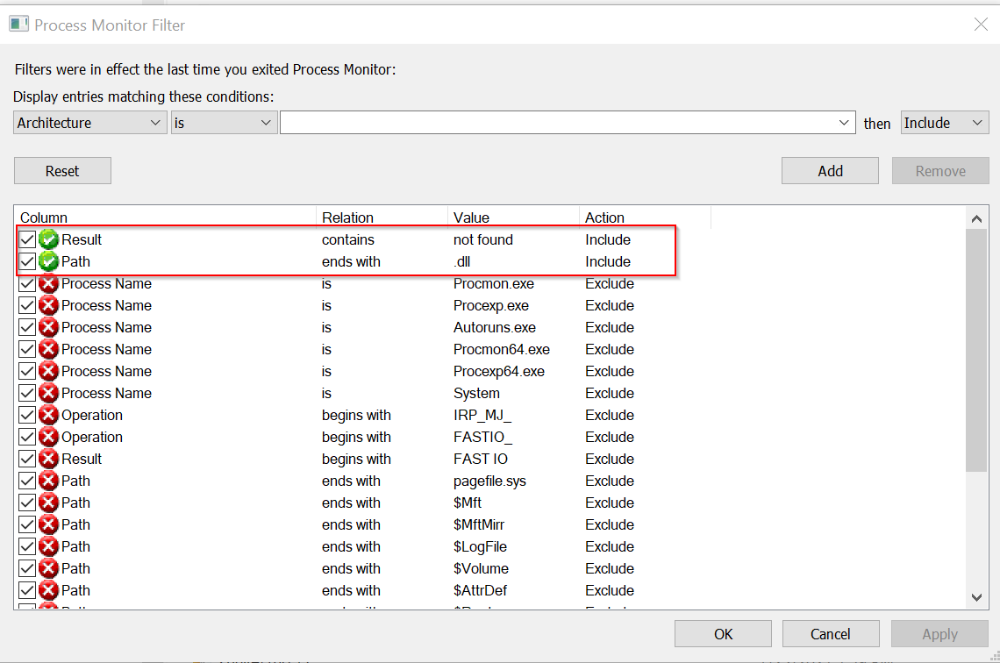

# Post exploitation

### Running Local Services
On an operating system many processes are running in the background as a service or a scheduled task. These services and tasks often require higher privileges to execute what they are designed for.

### Scheduled tasks/jobs
On a Linux system you may want to look into ‘cron’ jobs where on a Windows system you will be looking into ‘scheduled tasks’. These jobs/tasks can be default tasks (created during installation of the OS) or custom tasks. Usually you want to look into the custom tasks to hunt for any flaws in the design.

### Misconfigurations
Check if you have the permission to simply change the scheduled task or cron job.
Check the permissions of the folder that contains the executable or script, but also the permissions of folders that it may be using (analyze the script for that). If the script, is running by a higher privileged user, and it is using a directory where you have full control, you may want to look into creating 'symlinks'.

### Vulnerabilities
Scheduled tasks or cron jobs may also run executables that have vulnerabilities that can be exploited. A typical vulnerability that you may want to investigate on a Windows system is DLL hijacking (see also the "Local Services" section here below). If the executable is vulnerable to dll hijacking and loading dll’s from a location where you have write access, then you can create your own payload in a dll, which will be executed when the tasks runs. One of the misconfigurations to look at is the PATH environment variable as it will show you where the application might be looking for DLL’s that need to be loaded.

```
c:\> PATH
PowerShell:$ENV:PATH
```

### Local Services
During the information gathering you may have found services that are exposed externally (like SSH, FTP, HTTP, OracleDB and so on), but a system also has a lot of services that are running locally which are not exposed externally. On a windows system you will be interested in all services that are running as SYSTEM (see screensot below) or if you’re lucky, maybe you’ll find a system that is running with a domain account. Usually, the more interesting services are the non-Microsoft services as these are high likely installed after the installation of the OS.

```
c:\> Services.msc
Powershell: Get-WmiObject win32_service | select Name, DisplayName, State, PathName
```

Using <a href="https://docs.microsoft.com/en-us/sysinternals/downloads/procmon" target="_blank">procmon</a> you can identify services that are searching for dll’s that are trying to load dll’s that are not in their install directory; If you can find a location with a writable path you can create your own dll that spawns a shell with the privileges of the service. More information on DLL hijacking can be found <a href="https://itm4n.github.io/windows-dll-hijacking-clarified/" target="_blank">here</a>

The screenshot below shows the Procmon filter that you need to setup to capture applications that are searching for DLL's


Note: procmon for Linux can be found <a href="https://github.com/Sysinternals/Procmon-for-Linux" target="_blank">here</a>

### Permissions, services & users
Both Linux systems and Windows systems have the concept of user and group permissions. More information on these concepts can be found <a href="https://linuxfoundation.org/blog/classic-sysadmin-understanding-linux-file-permissions/" target="_blank">here</a> (Linux) and <a href="https://docs.microsoft.com/en-us/archive/msdn-magazine/2008/november/access-control-understanding-windows-file-and-registry-permissions" target="_blank">here</a> (Windows). When you were able to exploit a vulnerability and have remote or local command execution on the system, you're actions/commands may be limited on the system and you may need to escalate your privileges.
