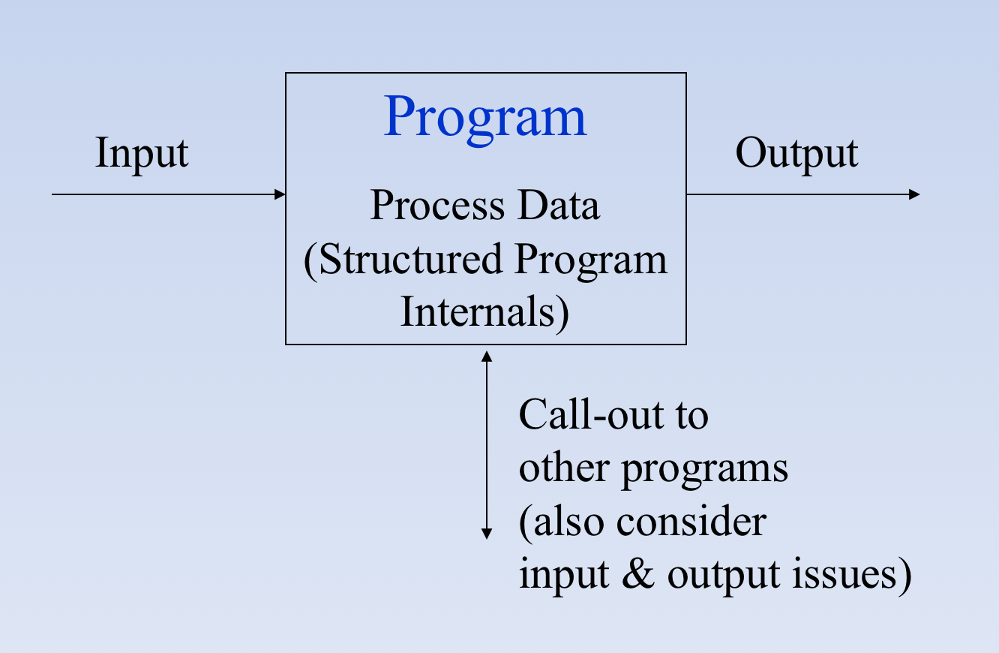

### Implementation Overview

You may know what your software is supposed to do (requirements) and may have a way to divide up the problem (design). But if your implementation is bad, the software is bad!

This section discusses how to implement secure software. We will do that by considering a very abstract view of a program, as illustrated by the following figure:

**Abstract View of a Program**

Almost all programs have inputs (that you should validate), process data, call out occasionally to other programs, and eventually produce output(s). Calling out to another program creates (essentially) inputs to those other programs, and outputs from those other programs. The next few subsections will discuss each of those areas in turn. We will then discuss a few specialized topics.

Of course, just saying *“write secure code”* or *“don’t make mistakes”* is not helpful. The good news is that nearly all errors that cause vulnerabilities today can be grouped into a relatively small number of categories, and some of those categories are especially common. So as noted earlier, we can eliminate a vast majority of security vulnerabilities simply by learning about these categories, knowing how to look for them, and mitigating them. We will repeatedly mention the OWASP Top 10 List (for web applications) and CWE Top 25 List (for applications in general), as they provide a useful way to identify what is most important.

A few of the common kinds of vulnerabilities are design problems. However, most of the rest are implementation issues. As we walk through our model of a program, we will discuss the relevant kinds of vulnerabilities, including how to detect them and counter them. Once you start applying this information, you will find that many vulnerabilities vanish from your program.

Practically all programs have to accept input. So we will begin examining how to implement secure software by discussing how to securely handle inputs.

# Input Validation

This chapter describes how to validate input, including how to validate numbers and text, the importance of minimizing attack surfaces, and how to improve availability by considering the inputs.

Learning objectives:

1. Discuss the basics of input validation.

2. Understand how to validate numbers.

3. Examine key issues with text, including Unicode and locales.

4. Explain how to use regular expressions to validate text input.

5. Understand the importance of minimizing attack surfaces.

6. Discuss secure defaults and secure startup.

7. Improve availability by considering the inputs.